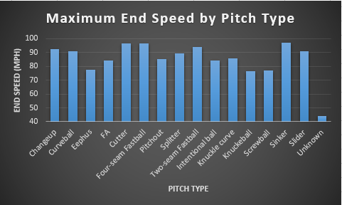

# MLB Pitching - Big Data

## Contributors 
* David Curtis
* Cole Houston
* Dylan Rongey
* Stephen Burke

## Links
* Public Repo: https://github.com/davidbradlycurtis/big-data-project/blob/master/README.md
* Issues: https://github.com/davidbradlycurtis/big-data-project/issues

## Introduction
Baseball is known as the sport for stats and data nerds, due to the fact that the insane amount of recorded stats for each game played. Our project hopes to reveal important trends, patterns, and averages that are important to the game of baseball. Some of these numbers we will find include the maximum end speed of different types of pitches, and the most common outcome of an atbat for each pitcher in the MLB.

## Data Source
  This data was collected from the MLB 2015-2018 regular seasons. There are five sets of structured data in CSV format and most of which have between ten and 40 columns. The entire dataset is 838mb in size with over 3 million entries. There are some holes in the data, so it will require some cleaning before consumption. This dataset is highly valuable, as the information that can be learned could provide teams an edge over their opponents. There are also no known solutions on the internet for the problems pertaining to this dataset.  
  
**Links:**
* Local: https://github.com/davidbradlycurtis/big-data-project/tree/master/data
* Original: https://www.kaggle.com/pschale/mlb-pitch-data-20152018#games.csv

## Setup and Execution
Clone this repository onto your local machine to an accessible location. Once successfully cloned, open the desired contributor's directory in PowerShell as an administrator. Run the mapper, sorter, reducer in order with the following commands:
* python (mapperFileName)
* python (sortshuffleFiileName)
* python (reducerFileName)
Once these commands have been successfully completed, the corresponding output file will have been created in the directory and will be waiting for review.

## Big Data Problems

#### David Curtis
  1. **The question:** For the type of pitch, I will find the maximum end speed of the pitch.
  2. **My Solution:**   
    1. Mapper input:  2	-6.409	-136.065	-3.995	101.14	2.28	158.78	50	5.302	4.16	10.93	55	3	C	S	FF	3	2015000001	0	0	0	1	0	0  
    2. Mapper output / Reducer input:  PO 84.1  
    3. Reducer output:  CH	92.4  
    4. My chart: I will be using a bar graph, as it will be easy to see the differences in speed end speed for each pitch type.
  3. **Results:**  

#### Cole Houston
  1. **The question:** For each batter, find the total number of groundouts.
  2. **My Solution:**  
    1. Mapper input:   572761	Groundout	201500001	1	1	0	L	425657	L	True
    2. Mapper output / Reducer input:  453923 Groundout
    3. Reducer output:   PLAYER_ID: 112526       GROUNDOUTS: 23
    4. My chart: A large number of players makes finding a viable chart difficult, but a bar graph could work with the player ID as the        x-axis and their overall groundouts on the y-axis.  A scatter plot could also work for this data.
    
#### Dylan Rongey
  1. **The question:**  For each pitcher, how many strikeouts have they thrown?
  2. **My Solution:**  
    1. Mapper input:   572761	Groundout	201500001	1	1	0	L	452657	L	TRUE  
    2. Mapper output / Reducer input:  Strikeout 452657 (thousands of times with varying outcomes)  
    3. Reducer output:   Strikeout 452657  
    4. My chart:  A bar graph would be interesting because it would allow you to easily compare all the pitchers in the league. 
    
#### Stephen Burke
  1. **The question:**  For each pitch type what's the max start speed?
  2. **My Solution:**  
    1. Mapper input:   0.416	2.963	92.9	84.1	2305.052	159.235	-25	3.2	23.7	7.665	34.685	-11.96	1.72	3.56	2	-6.409	-136.065	-3.995	101.14	2.28	158.78	50	5.302	4.16	10.93	55	3	C	S	FF	3	0	2015000001	0	0	0	1	0	0	0  
    2. Mapper output / Reducer input:  FF	92.9  
    3. Reducer output: AB	92.4  
    4. My chart:  Using a bar graph because I'm representing differences in catagorical data  
